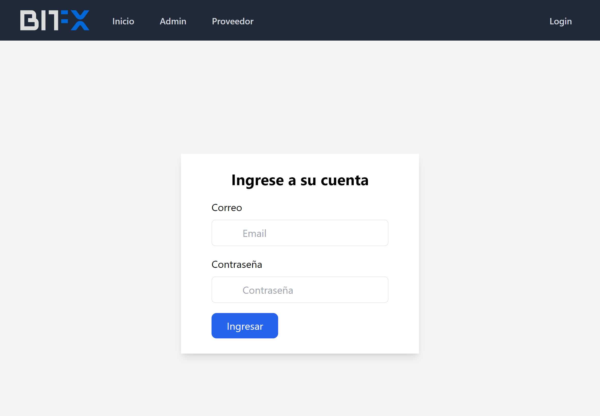
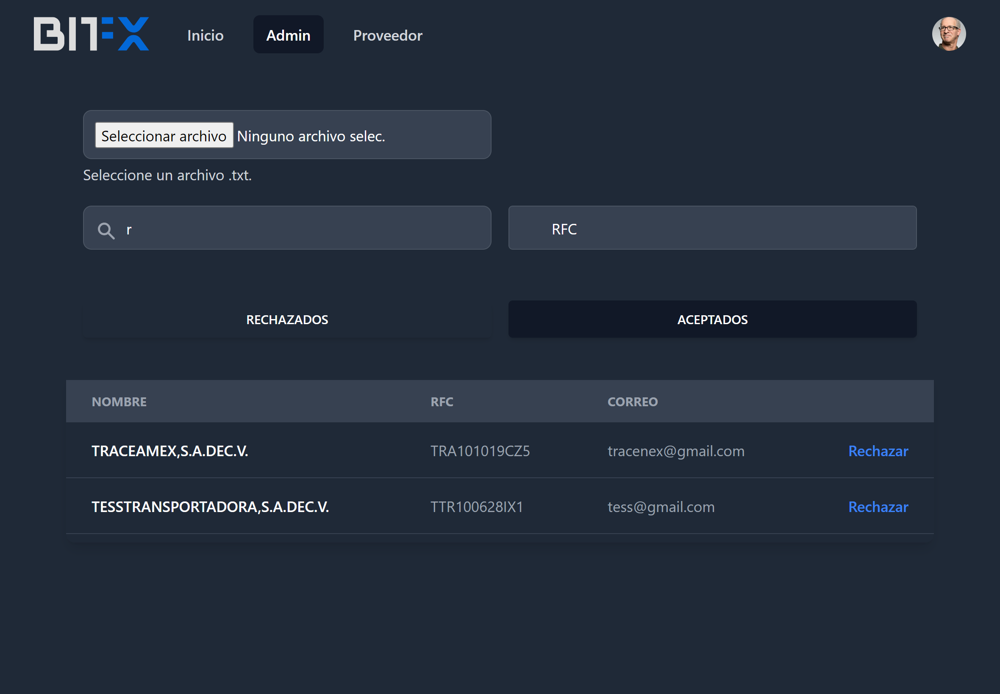
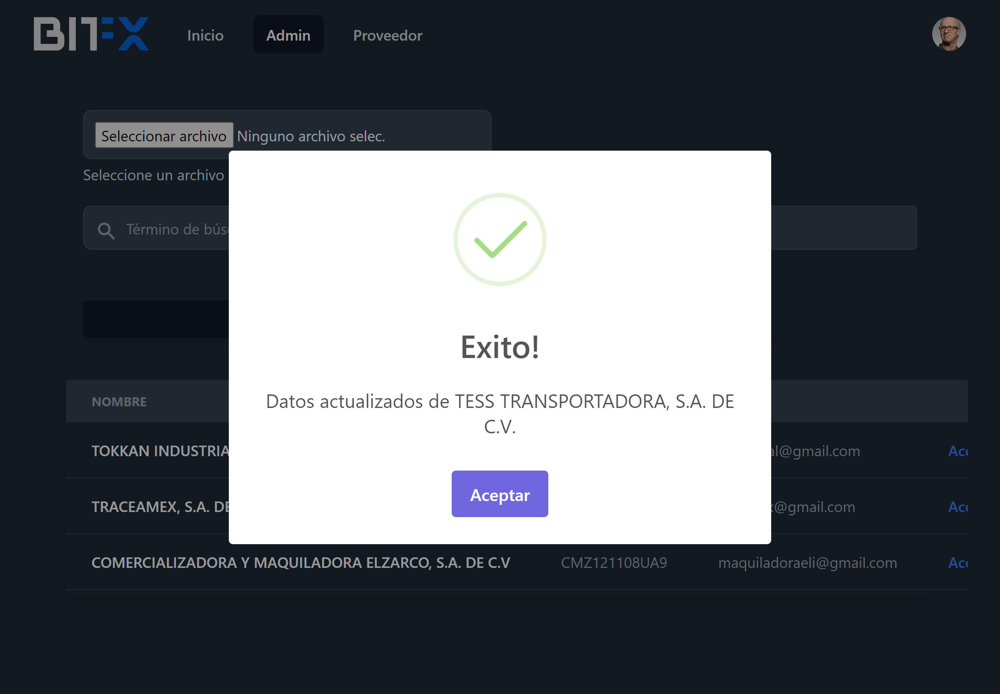
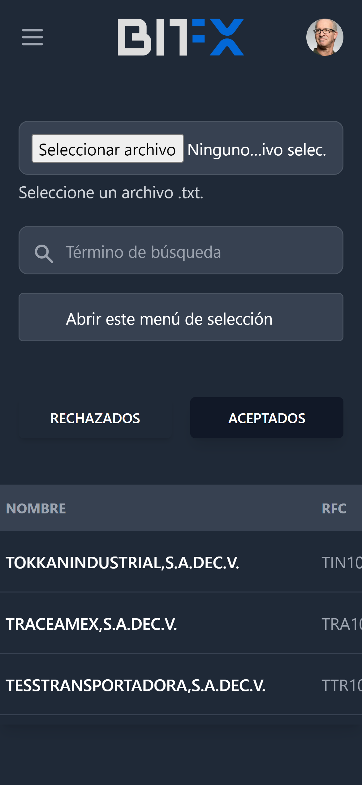

# Pasos a seguir

1. Despues de clonar el repositorio 
instalemos los paquetes 
```
npm install
```

2. Ejecutar el proyecto 
```bash
npm run dev
```

3. Debe tener ejecutado el proyecto [proveedor-backend](https://github.com/heriberto-hernandez/proveedor-backend)
en `http://127.0.0.1:8000`
porque es donde se hacen las peticiones de la aplicacion de lo conrario modifique todas las url.

<table style="width: 100%; text-align: center;">
    <tr>
        <td colspan="3" style="width: 100%; padding-top: 50px;">Usuarios</td>
    </tr>
    <tr>
        <td style="width: 33%;">Correo</td>
        <td style="width: 33%;">Contraseña</td>
    </tr>
    <tr>
        <td style="width: 33%;">admin@gmail.com</td>
        <td style="width: 33%;">password</td>
    </tr>
     <tr>
        <td style="width: 33%;">provider@gmail.com</td>
        <td style="width: 33%;">password</td>
    </tr>
</table>



Aqui debe subir solo archivos de textos, con un formaro especefico.
`nombre|email|rfc`
en este proyecto se anexan tres archivos de texto para la importacion


Esta es una alerta cuando se valida el proveedor


Visualizacion de dispositivos móviles



